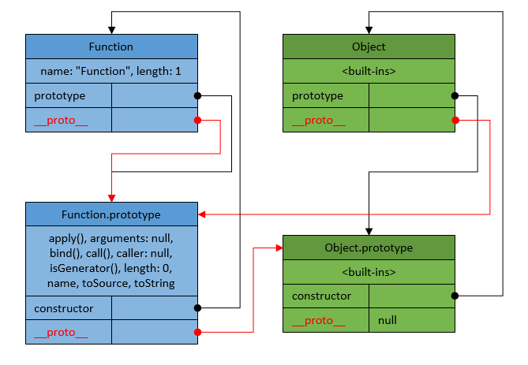
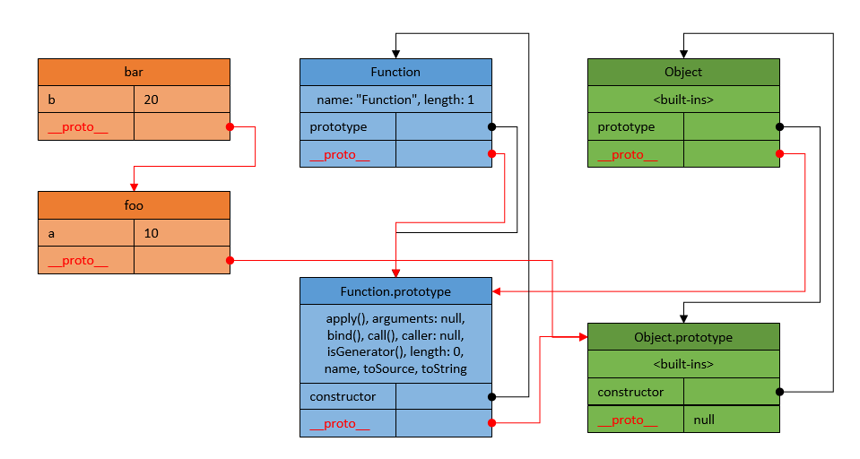
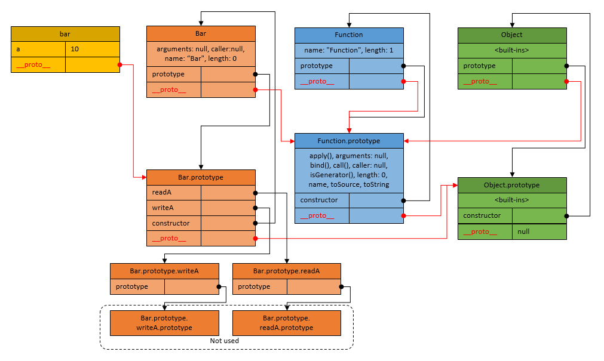

#  JavaScript prototype-based inheritance explained

This post is actual only for: 
* ECMA-262 5th edition called ECMAScript 5 (ES5) 
* ECMA-262 6th edition called ECMAScript 2015 (ES6)

This is a beginner-level post, just to clarify and visualize JavaScript prototype-based inheritance.

## Motivation
A lot of incomplete and even wrong info can be found on Internet about JavaScript prototypal inheritance. I will just try to explain it again with help of diagrams.

JavaScript inheritance understanding is important, even if you are not going to use JavaScript OOP patterns, since many of language built-in functionality based on inheritance.

I am not advocating of using OOP patterns and "classical"-like inheritance in JavaScript at all. 
I personally prefer using "factory" and "mixin" instead of a "constructor" pattern. But this post is not about patterns, it is only about JavaScript prototype-based inheritance *mechanics* visualization.

**Diagrams notation:**
* Blocks are JavaScript objects
* Title of the block denotes an accessor to that object
* All other sections in a block are properties of this object
* Arrows are references, with meaning, that given property holds reference to a pointed object. Source of arrow is important, it identifies property, but end is not, it is always points to another object
* Prototype chain, which is used by JavaScript inheritance system is colored in red
* Built-in porperties, some times, are not listed and shortened to `<built-ins>`

## TL;DR
This post is all about these diagrams:

<a href="https://raw.githubusercontent.com/rus0000/jsinheritance/master/images/Function-Object.png" target="_blank"></a>
<a href="https://raw.githubusercontent.com/rus0000/jsinheritance/master/images/foo.png" target="_blank"></a>
<a href="https://raw.githubusercontent.com/rus0000/jsinheritance/master/images/simple-object.png" target="_blank"></a>
<a href="https://raw.githubusercontent.com/rus0000/jsinheritance/master/images/bar.png" target="_blank"></a>
<a href="https://raw.githubusercontent.com/rus0000/jsinheritance/master/images/static.png" target="_blank"></a>
<a href="https://raw.githubusercontent.com/rus0000/jsinheritance/master/images/oop.png" target="_blank"></a>

If you understand them completely - you have done, if not - below is a more detailed explanation.

## Some JavaScript basics
### Basic part
* In JavaScript we have functions and objects
* There is no `classes` and no `constructors` in a language. ES6 `class` is only a syntactical sugar
* There are no `methods` or `members` in an object, there are only `properties`
* Object property can hold a value or reference to another object or function
* Functions are also objects, but of special type
* Any function can be invoked as a constructor, but this doesn't mean it *should* be invoked as a constructor
* Functions, which are intended to be used as constructors, just called `constructor functions`. Tey have to be invoked with a `new` keyword to construct a new object
* By convention, constructor functions are named with `PascalCase`, all other functions are named with `camelCase`
* Function in JavaScript is a main force. It can be used as:
  * a regular function
  * an object, because it is object
  * a constructor
  * a name space
  * a closure to capture context
  * ... and hundreds of other usages

### Advanced part
#### Functions
* Every **function declaration** immediately creates **TWO OBJECTS**:
  * the `function` object itself
  * the `prototype` object, belonging to this function
  * That happens **before** any code execution even begins, just after code parsing
* `function` object can be accessed just using function name without parenthesis, for example `myFunction`
* `prototype` object can be accessed using `prototype` property of `function` object, for example `myFunction.prototype`
* `prototype` object is used by JavaScript, when function is invoked as a `constructor` (with `new` keyword) to initialize newly constructed object `__proto__` property
* `prototype` object of `constructor function` is reminiscent of what is usually stored in `class` definition, in classical OOP languages like Java and C++
* `constructor function` and its `prototype` object are always come togehter
* `prototype` object does not used at all, if function is not intended to be used as a constructor

#### Objects
* Every object has a built-in `__proto__` property
* `__proto__` property correspond to internal, hidden `[[Prototype]]` property of the object
* `function` object and its `prototype` object, **both**, also have `__proto__` property
* `__proto__` property as an accessor, standardized only in ES6. In ES5, existance of `__proto__` property depends on implementation. In ES5 standard way to access value of `[[Prototype]]` property is `Object.getPrototypeOf()` method
* In ES6 `__proto__` property can be set, it just holds reference to another object. In ES6 there is also a `Object.setPrototypeOf()` method
* It is possible to create object without `__proto__` property using `var obj = Object.create(null)`
* Object, which is referenced by `__proto__` property of a given object, is called its `parent`. That `parent` object can also have `__proto__` property to its own `parent`, thus forming `prototype chain`
* `prototype chain` of objects or `prototypal inheritance chain` is a way, how **inheritance** is implemented in JavaScript
* When JavaScript runtime looks for a property, with a given name, on an object, it first examines object itself, and then all objects down its prototype chain

## Built-in constructor functions
This is a list of most popular JavaScript built-in constructors. They are constructors, not just functions, objects or namespaces - this is **important!**
* Array
* Boolean
* Date
* Error, and its derrivatives
* Function
* Math
* Number
* Object
* RegExp
* String

More reading: [Standard built-in objects] (https://developer.mozilla.org/en/docs/Web/JavaScript/Reference/Global_Objects)

Most confusing, of course, are `Function` and `Object`. Technically, they both are functions, constructor functions. 

## "Function" and "Object" terms mess
Close your eyes and take it as given.

JavaScript authors have named a function, with the name `Object()`. Then, they have made another function in the system, with the name `Function()`. And then, they have made technically every function in the system to be an object.

Of course, this is confusing. But, only for the first time. Then, you get used.

Speaker always need to be precisely clear, what he is talking about.

Meanings of term "object":
* Built-in `Object` constructor
* Specific JavaScript object, referenced by some access path
* A `constructor` with its `prototype`
  * The problem here in the fact, that we have no `classes`, and JavaScript developers often call it `object` but with meaning `type`. Better not to use terms `class`, `type`, `object`, `object type`, but  use only terms `constructor` or `constructor function`
* JSON object
  * JSON stands for "JavaScript Object Notation"".
  * Typical misuse and misunderstanding is, that JSON is not an object, it is always a `string`, which will become an object in the memory only after parsing
* POJO, which stands for "Plain Old Javascript Object", or just "simple object"
  * This is an object without any custom prototype chain, or any added "methods", just a container for data
  * Its `__proto__` property refers directly to `Object.prototype`, or equal to `null`
  * Can be considered as a Hash

Meanings of term "function":
* Built-in `Function` constructor
* Specific named JavaScript function, referenced by name created with `function declaration`
* Specific anonymous JavaScript function, referenced by some access path

## Function and Object constructors relation
Relation between `Function` and `Object` constructors is very important. It plays major role in JavaScript inheritance.

To summarize:
* Every function in JS is an object, more exactly - two objects: function itself and its prototype
* There are two distinct constructor functions `Function` and `Object` related to each-other
* `Function.prototype` object itself inherits from `Object.prototype`
* Every function in the system inherits from `Function.prototype`
* Every object in the system inherits from `Object.prototype`


The prototypal inheritance chain is drawn in red.

As you may see `Function` and `Object` are both functions, thus, they both have `prototype` property, which holds  reference to respective `prototype` object.

`Function` and `Object` are both functions, thus their `__proto__` property, refers to `Function.prototype`, which itself has `__proto__` property referencing to `Object.prototype`.

Both `prototype` and `__proto__` properties of a `Function` refer to the same `Function.prototype` object, which is an exclusive situation, existing only for built-in `Function` constructor.

## "Prototype" term mess
When one says word "prototype", it immediately starts real mess in heads of his listeners. Speaker always need to be precisely clear, what he is talking about.

Meanings of term "prototype":
* A prototype of a given object
  * Its parent
  * Accessible with `someObject.__proto__` property, not `prototype` property
  * The most confusing part is:
    * Parent of a `someObject` object, referenced by `someObject.__proto__` property, is commonly called its **prototype**
* A `prototype` object of a given function, especially a constructor function
  * Accessible with `SomeConstructor.prototype` property
  * That should be called **constructor prototype**
* A built-in `Function.prototype` object
* A built-in `Object.prototype` object
* A prototype of any other built-in constructor, for example `String.prototype`

To summarize:
* Only a function may have `prototype` property
* Any function has `prototype` property
* `prototype` property of a function holds reference to an auxiliary object, which is used only, when the function is invoked as a constructor, with `new` keyword, and completely ignored for all other regular functions
* Any object has prototype chain
* **Prototype chain is built using `__proto__` property, not `prototype` property**
* Functions are also objects, and thus have `__proto__` property, referencing to `Function.prototype` built-in object
* All prototype chains ends with `Object.prototype`
* `Object.prototype.__proto__` holds `null`. This is real end of prototype chain

## Function in JavaScript
Having simple function declaration, we get following inheritance.
```javascript
function foo(){}
```


What we can se here:
* function declaration creates two objects: `foo` itself and `foo.prototype`, even if `foo` does not going to be used as constructor function
* `foo` inherits from `Function.prototype`
* `foo.prototype` inherits from `Object.prototype`
* this inheritance valid for any, even anonymous function

What we don't see is that `foo` itself has internal `[[Code]]` property, which cannot be accessed but is used when we invoke it with `foo()`.

When you use `foo.someMethod()`, all built-in methods come from `Function.prototype` and down the chain from `Object.prototype`. But `foo.someMethod()` never comes from `foo.prototype`. See [Static methods](https://github.com/rus0000/jsinheritance/blob/master/README.md#static-methods).

`foo.prototype` typically does not used at all, if function is not a constructor, and vice versa, is used in the case of a constructor function.

`foo.prototype` can be set to any other object reference or primitive value. Setting it to a new object or define new properties on it is a common pattern to define a constructor.

## Creating simple objects with inheritance
Simple objects created as object literals or with `Object.create` function.
```javascript
// Simple object literal
var foo = {
  a: 10
};

// foo object will be used as prototype for bar
var bar = Object.create(foo, {
    b: {
      value: 20
    }
  });

console.log(bar.__proto__ === foo); //true
console.log(bar.a); // 10 - Inherited property
console.log(bar.b); //20 - Own porperty
console.log(foo instanceof Object); // true, foo inherits from Object
console.log(bar instanceof Object); // true, bar inherits from Object
```


Important moment here is that in case of changing `bar.a` value, JavaScript automatically creates `bar.a` own property with new value, to prevent prototype pollution.

Even if prototype chain of `foo` and `bar` looks very simplistic, we can note, that both have an inherited `constructor` property, which points to the `Object` constructor, which itself inherits from `Function.prototype`. More of that, there are a lot of built-in methods in `Object.prototype` itself, not displayed for clarity. They all are accessible on `foo` and `bar`.

## Creating an object with constructor function
Now, let's declare a simple constructor function and create an object instance using it.
```javascript
function Bar() {
  //this will point to newly created object
  this.a = 10;
}

Bar.prototype.readA = function () {
  //this will point to the object, in context of which, method will be invoked
  return this.a;
}

Bar.prototype.writeA = function (a) {
  this.a = a;
}

var bar = new Bar();

console.log(bar.constructor === Bar); // true
console.log(bar instanceof Bar); // true
console.log(bar instanceof Object); // true, bar inherits from Object
console.log(bar.readA()); // 10 - Invoking inherited method
bar.writeA(20);
console.log(bar.readA()); // 20
console.log(bar.a); // 20 - Reading own porperty
```


`readA` and `writeA` are just regular JS functions with similar references to `Function` and `Object` as `Bar` function itself. These references are not shown for clarity. The only important difference with `Bar` is, that their prototypes are not of any use.

`bar` object has its own property `a`, because this property created every time `Bar` constructor is invoked. This behavior allows to produce different objects with their own property `a`, but inheriting "methods" from `Bar.prototype`.


## Static methods
There is no such thing like `static method` in JavaScript spec at all, but this design pattern can easily be implemented by putting properties on a `constructor function` object itself, instead of its `prototype` object.

```javascript
function Bar() {
  this.a = 10;
}

Bar.staticMethod = function () {
  return "I am static";
}

Bar.prototype.readA = function () {
  return this.a;
}

Bar.prototype.writeA = function (a) {
  this.a = a;
}

var bar = new Bar();

console.log(bar.staticMethod); // undefined, method can not be invoked on instance
console.log(Bar.staticMethod()); // "I am static"
```


Static methods of constructor are not accessible on objects, created with this consrtuctor, they are available on a constructor itself.

A lot of useful design patterns in JavaScript are implemented putting methods on a `constructor function` object, for example `factory` functions. Such a `constructor` can be used as a `namespace` or `singleton`.

## Classical JavaScript inheritance and OOP
```javascript
// Parent constructor
var Duck = function (name){
  this.name = name;
};

// Parent method
Duck.prototype.quack = function (){
  return this.name + " Duck: Quack-quack!";
};

// Child constructor
var TalkingDuck = function (name){
  // Call parent constructor
  Duck.call(this, name); // This is often forgotten
}

// Inheritance
TalkingDuck.prototype = Object.create(Duck.prototype);
TalkingDuck.prototype.constructor = TalkingDuck; // This is often forgotten

// Method overload
TalkingDuck.prototype.quack = function (){
  // Call parent method
  return Duck.prototype.quack.call(this) + " My name is " + this.name;
};

// Object instantiation
var donald = new TalkingDuck("Donald");
donald.quack(); // "Donald Duck: Quack-quack! My name is Donald"
```


Prototype chain of `donald` is `donald -> TalkingDuck.prototype -> Duck.prototype -> Object.prototype`. `Function.prototype` does not taking part in this chain, since `donald` is not a function.
```javascript
console.log(donald.__proto__ === TalkingDuck.prototype); // true
console.log(TalkingDuck.prototype.__proto__ === Duck.prototype); // true, result of invoking Object.create()
console.log(Duck.prototype.__proto__ === Object.prototype); // true
console.log(donald.quack === TalkingDuck.prototype.quack); // true, method found by prototype chain
console.log(donald instanceof TalkingDuck); // true
console.log(donald instanceof Duck); // true
```

## Prototype pollution
Prototype pollution is changing properties of objects in a prototype chain, affecting all other existing instances.
The rule of thumb, is not to put properties on a constructor prototype object. Only initialize them inside constructor function body. Constructor prototype should have only methods.

**Wrong!**
```javascript
function Collection(){}

// Shared between instances, - wrong
Collection.prototype.elements = [];

Collection.prototype.add = function (x){
  // Each instance adds values to the same array
  this.elements.push(x);
};
```

It should be

```javascript
function Collection(){
  // Each instance gets its own array, - good
  this.elements = [];
}

// No changes in code, but result will be different
Collection.prototype.add = function (x){
  this.elements.push(x);
};
```

## Factory functions
Factory function in JavaScript is not a language feature, it is a pattern. Many patterns in JavaScript are available just because of the power of prototype-based inheritance.

Factory function is very popular and powerful JavaScript OOP pattern. There are hundreds of implementations of it in many libraries and framweorks, and of course, you can create your own.

Factory function pattern is simple, it allows you create JavaScript objects and establish `prototypal inheritance chain`, but without usage of `constructor function`, using `factory function` instead. Factory functions can use constructors behind the scenes.

Node.js `http.createServer` is a typical example of factory function. It returns a new instance of `http.Server` class. New object is created wthout using `constructor function` and `new` keyword.

```javascript
// Load the http module
var http = require('http');

// Call factory function to construct a new instance
var server = http.createServer(function (request, response) {
  response.writeHead(200, {"Content-Type": "text/plain"});
  response.end("Hello World\n");
});

// server is an instance of http.Server class
console.log(server instanceof http.Server); // true

// Call listen method inherited from http.Server class 
server.listen(8000);

console.log(server.hasOwnProperty('listen')); // false
```
Factory function can result in prototype chain similar to what we get using constructors. It is also can be implemented without usage of constructors, replacing them with some sort of `init` function, but still resulting in a prototype chain of objects. In later case `instanceof` operator will not work, and developer may need to use `Duck typing` to detect object type.

## Mixins
Mixin is another popular and powerful JavaScript pattern. It is also kind of inheritance but not using `prototypal inheritance chain`.

Main goals of using mixins are `multiple inheritance` and `performance boost`.

Mixin is a function, which mixes behaviours from one or more `donor` objects to `target` object. Technically, it consists of copying all methods and properties from donors to target object, allowing it to achieve similar behaviour.

The most important part here, is that methods, copied from donors are not copied or cloned itself. They are not duplicated. The mixin function only copies references to them. All resulting mixed instances refer to the same set of functions.

Multiple inheritance is achieved by mixing several objects into one.

Performance boost is achieved by the fact, that prototype chain lookups in JavaScript are expensive, and when all methods from parents reside directly on a child, it accelerates performance.

Mixin function holds intact `__proto__` property of target object.

`instanceof` operator, as well, will not work.

## Reading
* [Inheritance and the prototype chain](https://developer.mozilla.org/en-US/docs/Web/JavaScript/Inheritance_and_the_prototype_chain)
* [Function](https://developer.mozilla.org/en-US/docs/Web/JavaScript/Reference/Global_Objects/Function)
* [Object](https://developer.mozilla.org/en-US/docs/Web/JavaScript/Reference/Global_Objects/Object)
* [Dr. Axel Rauschmayer blog](http://www.2ality.com/)
* [Juriy Zaytsev (kangax) blog](http://perfectionkills.com/)
* [Dmitry Soshnikov blog](http://dmitrysoshnikov.com/ecmascript/javascript-the-core/)
* [Addy Osmani Learning JavaScript Design Patterns](http://addyosmani.com/resources/essentialjsdesignpatterns/book/)
