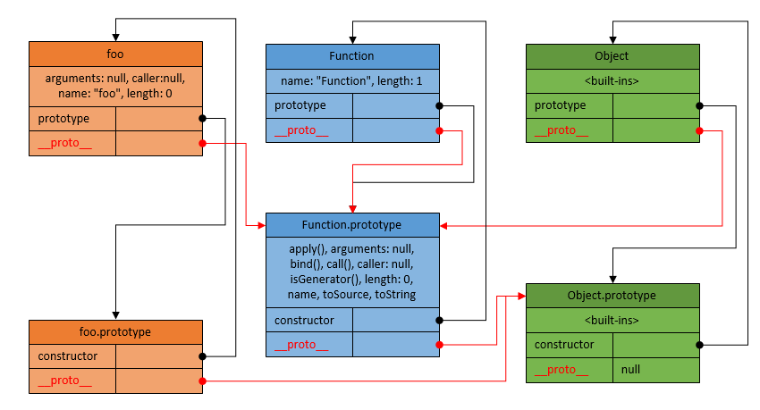
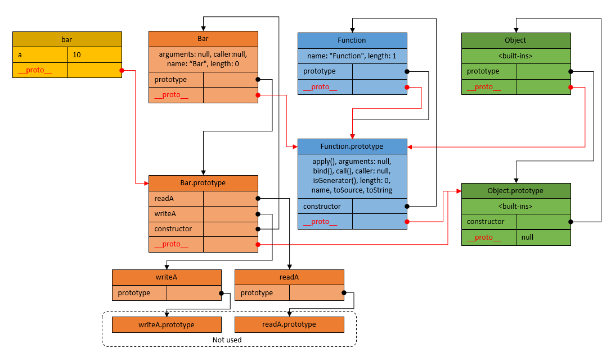
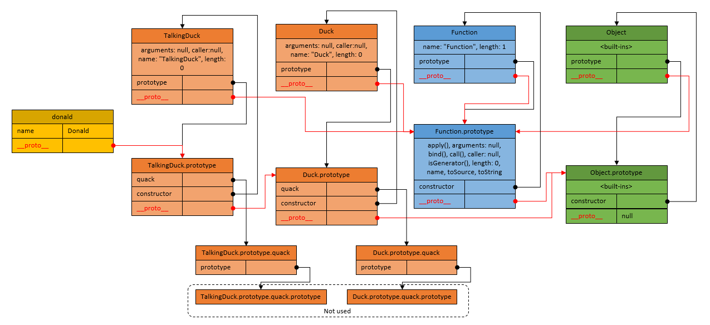

#  JavaScript prototype-based inheritance model

This post is actual for ECMA-262 3rd edition (ES5) and ECMAScript 2015 (ES6)
## Motivation
A lot of incomplete and even wrong info can be found on Internet about JavaScript inheritance model. I just try to explain it again with help of diagrams.

Thanks to Dmitry Soshnikov for his excellent post: [JavaScript. The core.] (http://dmitrysoshnikov.com/ecmascript/javascript-the-core/)

JavaScript inheritance model understanding is important even if you are not going to use JavaScript OOP patterns, since many of built-in functionality based on inheritance.

## Some JavaScript basics
* In JavaScript we have functions and objects
* Functions are also objects but of special type
* Functions does not bound or belongs to objects
  * There is no "methods" in JavaScript. "Method" is only a semantic use of function in context of object. Object can have property, which is a function reference. When such a function is invoked using `object.function()` notation, it is executed in context of object. But the same function can be invoked in another context as well
* Every function (technically) can be used as a constructor, but this doesn't mean it *should* be used as a constructor
* By convention, functions, which are intended to be used as constructors, named with `PascalCase`, all other functions named with `camelCase`
* Constructor functions are intended to be invoked with `new` keyword to construct a new object
  * When constructor functions are invoked without `new` keyword, *depending on implementation*, they may
    * silently fail and produce undesired effect
    * throw an error
    * handle this situation, and work as appropriate
* Every function declaration immediately creates TWO OBJECTS: 
  * function object itself
  * function prototype object
* Function `prototype` object is used by JavaScript when function is invoked as a constructor (with `new` keyword) to initialize newly created object `__proto__` property
* Every object has built-in `__proto__` property
  * `__proto__` property correspond to internal, hidden `[[Prototype]]` property of the object
  * `__proto__` property accessors standardized only in ES6. In ES5, standard way to access this property is `Object.getPrototypeOf()` method
  * In ES6 it can be set, it is just object reference
  * As functions are also objects, they also have it
  * It is possible to create object without `__proto__` property using `var obj = Object.create(null)`, but it does not have useful application
* Object referenced with `__proto__` property of given object is its "parent". Parent can also have `__proto__` property to its "parent", thus forming "prototype chain"
* "Prototype chain" of objects or "prototypal inheritance chain" is not the same as an "Inheritance model". 
* "Inheritance model" is a specifically organized chain of constructors
  * Again, remember, every constructor function consists of TWO objects

## Built-in constructor functions
Here is a list of most popular JavaScript built-in constructors. They are constructors, not just objects - this is important!
* Array
* Boolean
* Date
* Error
* Function
* Math
* Number
* Object
* RegExp
* String

More complete list is here [MDN:Standard built-in objects] (https://developer.mozilla.org/en/docs/Web/JavaScript/Reference/Global_Objects)

Most confusing, of course, are `Function` and `Object`. Technically, they both are functions, constructor functions. 

## "Function" and "Object" terms mess
Close your eyes and take this as given. 

JavaScript authors have named a function, with the name `Object`. Then, they have named another function, with the name `Function`. And then, they have made every function in a system to be an object.

Of course, it is confusing. But, only for the first time. Then, you get used.

To summarize:
* Every function in JS is an object, more exactly - two objects: function itself and its prototype object
* There are two distinct constructor functions `Function` and `Object` related to each-other (see later)
* Every function in system inherits from `Function.prototype`
* Every object in system inherits from `Object.prototype`
* `Function.prototype` itself inherits from `Object.prototype`

## "Prototype" term mess
When one says word "prototype", it immediately starts real mess in heads of his listeners. Speaker always need to be precisely clear, what he is talking about.

Meanings of term "prototype":
* A prototype of a given object
  * Its parent
  * Accessible with `someObject.__proto__` property
* A prototype object of a given function, especially a constructor function
  * Accessible with `SomeConstructor.prototype` property
* A built-in `Function.prototype` object
* A built-in `Object.prototype` object
* A prototype of any other built-in constructor, for example `String.prototype`

To summarize:
* Only a function may have `prototype` property
* `prototype` property of a function holds reference to an auxiliary object, which is used only when function is invoked as a constructor, with `new` keyword, and completely ignored in all other cases
* All objects may have prototype chain
* Prototype chain is built using `__proto__` property, not `prototype` property
* Functions are also objects, and thus have `__proto__` property, typically referencing to `Function.prototype` built-in object. Usually there is no chaining, just direct reference to `Function.prototype`.
* All prototype chains typically ends with `Object.prototype`

## Function and Object constructors' relation
Relation between `Function` and `Object` constructors is very important, since it takes part in inheritance model.


The prototypal inheritance chain is drawn in red.

As you may see `Function` and `Object` are both functions, thus they both have a `prototype` property, which is a reference to another object, which is called "constructor prototype".

`Function` and `Object` are both functions, thus their `__proto__` property, refers to `Function.prototype`, which itself has `__proto__` property referencing to `Object.prototype` and forming "prototypal inheritance chain".

Both `prototype` and `__proto__` properties of a `Function` refer to the same `Function.prototype` object.

## Function in JavaScript
Having simple function declaration, we get following inheritance model.
```javascript
function foo(){}
```


Here we see that
* function declaration creates two objects: `foo` itself and `foo.prototype`, even if `foo` does not going to be used as constructor function
* `foo` inherits from `Function.prototype`
* `foo.prototype` inherits from `Object.prototype`
* this inheritance valid for any, even anonymous function

What we don't see is that `foo` itself has internal `functionBody` property, which cannot be accessed but used when you type `foo()`. 

When you use `foo.someMethod()`, all built-in methods come from `Function.prototype` and down the chain `Object.prototype`.

`foo.prototype` typically does not used at all if function is not a constructor, and vice versa, extensively used in the case of constructor function.

## Creating simple objects with inheritance
Simple objects created as object literals or with `Object.create` function.
```javascript
// Simple object literal
var foo = {
  a: 10
};

// foo object will be used as prototype for bar
var bar = Object.create(foo, {
    b: {
      value: 20
    }
  });

console.log(bar.__proto__ === foo); //true
console.log(bar.a); //10
console.log(bar.b); //20
```


Important moment here is that in case of changing `bar.a` value, JavaScript automatically creates `bar.a` own property with new value, to prevent prototype pollution.

## Creating an object with constructor function
Now, let's declare a simple constructor function and create an object instance using it.
```javascript
function Bar() {
  this.a = 10;
}

Bar.prototype.readA = function () {
  return this.a;
}

Bar.prototype.writeA = function (a) {
  this.a = a;
}

var bar = new Bar();
```



`readA` and `writeA` are just regular JS functions with similar references to `Function` and `Object` as `Bar` function itself. These references are not shown for clarity. The only important difference with `Bar` is, that their prototypes are not of any use.

`bar` object has its own property `a`, because this property created every time constructor is invoked. This behavior allows to produce different objects with their own property `a` but inheriting "methods" from `Bar` prototype.

## Classical JavaScript inheritance model and OOP
```javascript
// Parent
var Duck = function (name){
  this.name = name;
};

// Parent method
Duck.prototype.quack = function (){
  return this.name + " Duck: Quack-quack!";
};

// Child
var TalkingDuck = function (name){
  // Call parent constructor
  Duck.call(this, name);
}

// Inheritance
TalkingDuck.prototype = Object.create(Duck.prototype);
TalkingDuck.prototype.constructor = TalkingDuck;

// Method overload
TalkingDuck.prototype.quack = function (){
  // Call parent method
  return Duck.prototype.quack.call(this) + " My name is " + this.name;
};

// Instantiation
var donald = new TalkingDuck("Donald");
```



Prototype chain of `donald` is `donald -> TalkingDuck.prototype -> Duck.prototype -> Object.prototype`. `Function.prototype` does not taking part in this chain, since `donald` not a function.
```javascript
console.log(donald.__proto__ === TalkingDuck.prototype); // true
console.log(TalkingDuck.prototype.__proto__ === Duck.prototype); // true
console.log(Duck.prototype.__proto__ === Object.prototype); // true
console.log(donald.quack === TalkingDuck.prototype.quack); // true, method found by prototype chain
```

## Prototype pollution
Prototype pollution is changing properties of objects in a prototype chain, affecting all other existing instances.
The rule of thumb is not to put properties on a constructor prototype object. Only initialize them inside constructor function body. Constructor prototype should have only methods.

```javascript
function Collection(){}

// Shared between instances, - wrong
Collection.prototype.elements = [];

Collection.prototype.add = function (x){
  // Each instance adds values to the same array
  this.elements.push(x);
};

//It should be
function Collection(){
  // Each instance gets its own array, - good
  this.elements = [];
}

// No change
Collection.prototype.add = function (x){
  this.elements.push(x);
};
```

## Reading
[Function](https://developer.mozilla.org/en-US/docs/Web/JavaScript/Reference/Global_Objects/Function)

[Object](https://developer.mozilla.org/en-US/docs/Web/JavaScript/Reference/Global_Objects/Object)

[Object.prototype](https://developer.mozilla.org/en-US/docs/Web/JavaScript/Reference/Global_Objects/Object/prototype)

[Juriy Zaytsev (kangax) blog](http://perfectionkills.com/)

[Dmitry Soshnikov blog](http://dmitrysoshnikov.com/)

[Dr. Axel Rauschmayer blog](http://www.2ality.com/)
